# Design Document

**Authors**: Shuyan Huang, Hitesh Kathuria

## 1 Design Considerations

### 1.1 Assumptions
* During a time slot, there is only one user interacting with the system. This indicates no concurrency exists in this application.
* The entire application including data is stored on the local phone.
* The application is only applicable to Android devices rather than Apple devices.

### 1.2 Constraints
* The system must run Android application successfully.
* This application have the permission to read and write access to the database.
* There will be only one Administrator.
* The player could only (1) create a cryptogram, (2) solve a random cryptogram, and (3) view the list of player scores.
* The administrator could only (1) view the list of cryptogram statistics, and (2) disable a cryptogram.
* A new player will start with 20 points in their total number of points.
* The followings should be unique: username (and/or email), cryptogram title, encoded letters.
* No letter may be encoded to itself.
* The player’s total number of points will be increased by 5 for creating a new cryptogram.
* Bet points should be between 1 and 10, or all of player's points, whichever is less.
* A disabled cryptogram will not be randomly selected in the future for any players starting a game, but will not affect any previous or   in progress games.
* Penalization points should be 0-10 points or the player’s total number of points, if that is less.

### 1.3 System Environment

* System must support Android SDK platform and Android operating system.
* System must support Android Room Persistence Library.

## 2 System Design

### 2.1 Component Diagram

    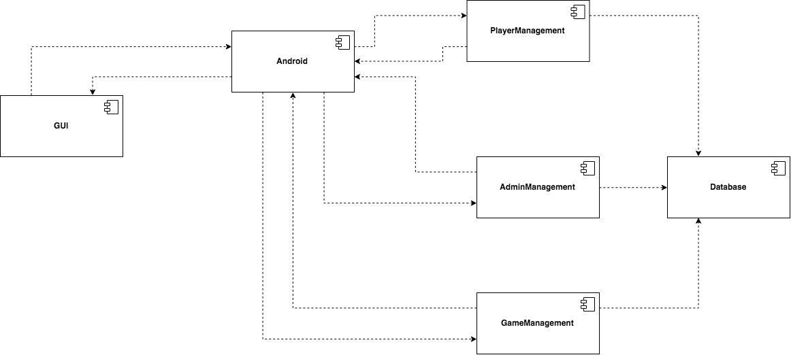

### 2.2 Class Diagram

    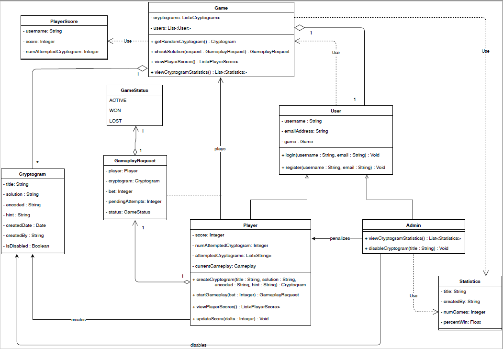

## 3 User Interface Design

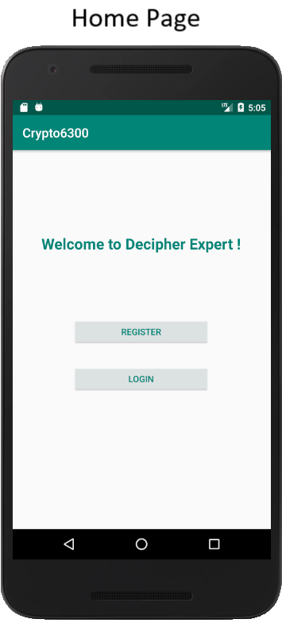
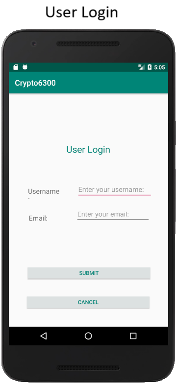
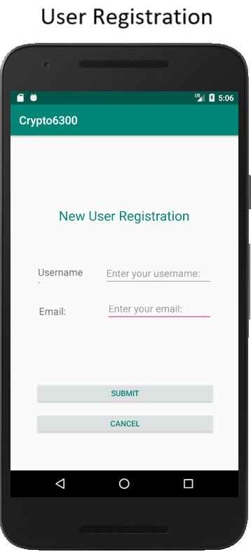

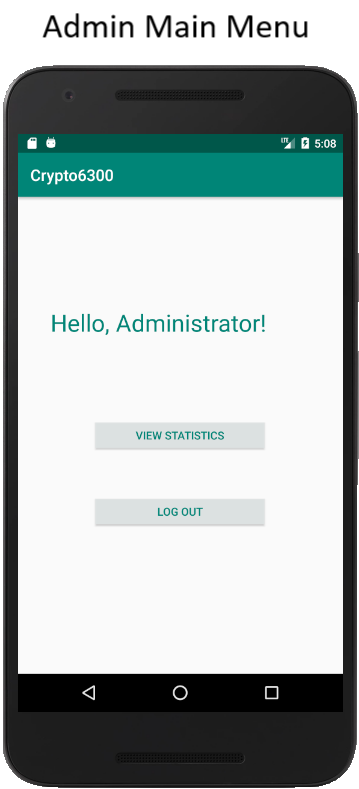
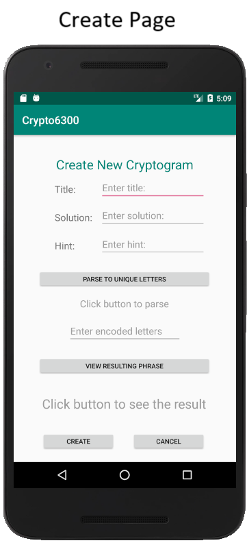
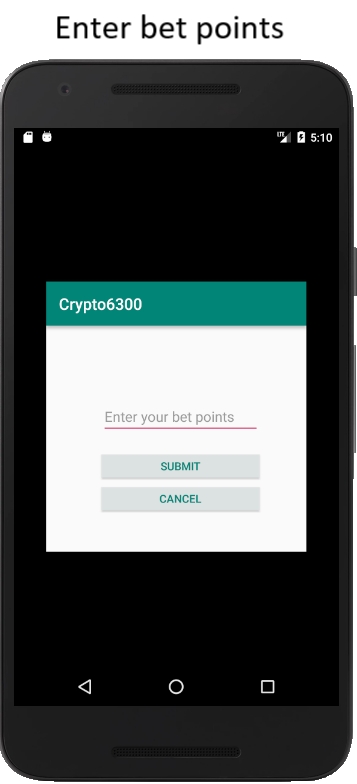
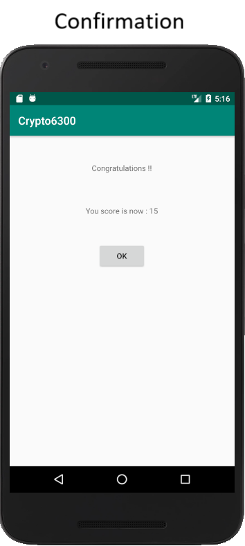
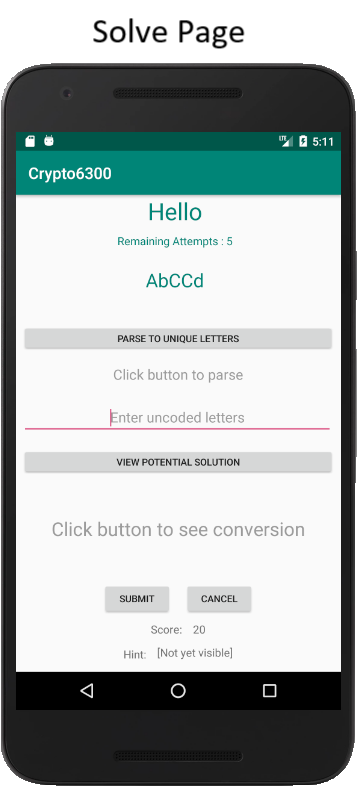
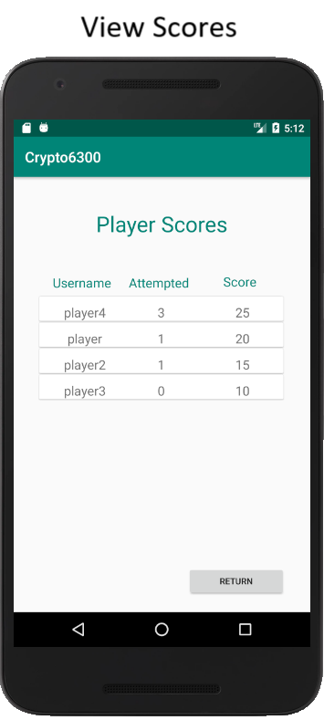
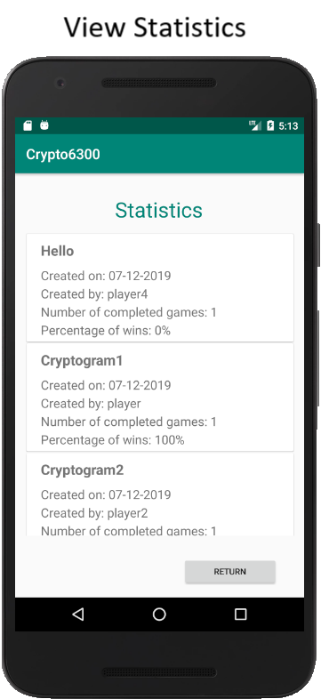
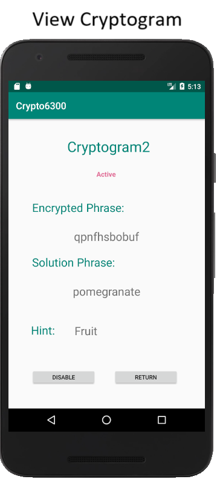