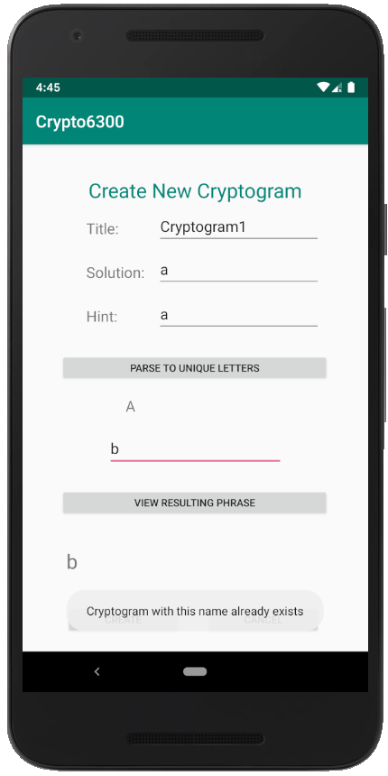

# Test Plan

**Authors**: Hitesh Kathuria, Shuyan Huang, Yujia Huang

## 1 Testing Strategy

### 1.1 Overall strategy

The entire testing will be divided into 4 categories :

Unit tests : This will be done to test specific methods in a class as a unit. Cross class methods will not be invoked. They will be mocked to test each unit in isolation. The author of the code is responsible to write unit tests as well.

Integration tests : Happy path integration tests will be written that tests inteaction between classes. These will be divided among the team mates.

System tests : These tests will cover end-to-end functionality beginning with the UI. These tests are stretch goal for the project and will only be implemented if time permits. These will be divided among the team mates.

Regression : No separate regression tests will be written. regression will be assessed by runnning all other types of tests every time a new change is made.

### 1.2 Test Selection

Unit tests will be written for all classes. However, keeping the timelines in mind, it wont be possible cover all edge cases. Major happy path cases and a few negative cases will be covered.

Each requirement will transform into one black box test - this will either be covered as an integration test or as a system test. This will majorly be covered using category based partitioning technique.

For classes with complex logic, white box testing techniques will be used to ensure different branches are taken for different inputs as expected. White box testing will be omitted for very straight forward methods and classes. This will majorly be convered using unit tests.

### 1.3 Adequacy Criterion

Keeping the timelines in mind, a realistic expectation would be to have 50% code coverage and 50% branch coverage in unit tests.
For integration tests, 50% if the major and easily testable requirements will be covered.

### 1.4 Bug Tracking

A table like below will be used either in a shared document or in the repository itself to track bugs.

| Issue number   | Issue Summary | Priority | Reporter  | Date  | Status | 
| :------------- |:-------------:| --------:| ---------:| -----:| ------:|

### 1.5 Technology

Unit tests will be implemented using JUnit and Mockito.
UI Automation tests is implemented will be done using Selenium.
Integration tests will be implemented by instatiating actual classes and not mocking any.

## 2 Test Cases

The following table covers tests implemented as Integration/System tests. Unit tests are not explicitly mentioned in this table. The number and lists of tests are chosen to give maximum confidence of the functionalities keeping the timelines restrictions in mind.

| Test number    | Purpose       | Step | Expected Result  | Actual  | Status |
| :------------- |:-------------:| :--------:| :----------------:| :-------:| :------:|
| 1 |administrator could login|see below| see below| success | pass |
| 2 |administrator can't be register| see below| see below| failed | pass|
| 3 |new user can be registered and login| see below| see below |success| pass|
| 4 |user cannot register with an existing username| see below| see below| failed| pass|
| 5 |user can't login with either `Username` or `Email` empty| see below| see below| failed| pass|
| 6 |user can't register with either `Username` or `Email` empty| see below| see below| failed| pass|
| 7 |`CANCEL` button in the Registration Page and Login Page functions well| see below| see below| work | pass|
| 8 |player and administrator can log out| see below | see below| success|pass|
| 9 |player can create a cryptogram| see below|see below| success| pass|
| 10 |player can not create a cryptogram with any letter encoded to itself|see below| see below| failed|pass|
| 11 |player can create a cryptogram with capitalization and any non-alphabetic characters preserved| see below| see below| success| pass|
| 12 |player can not create a cryptogram already exists| see below| see below| failed| pass|
| 13 |player can not create a cryptogram with empty title| see below| see below| failed| pass|
| 14 |player can not create a cryptogram with empty hint| see below| see below| failed| pass|
| 15 |player can not create a cryptogram without empty encoded letter| see below| see below| failed| pass|
| 16 |player can not create a cryptogram with single encode letter represents multiple solution letters| see below| see below| failed| pass|
| 17 |`PARSE TO UNIQUE LETTERS` button and `VIEW RESULTING PHRASE` button functions well in the Create Cryptogram Page| see below| see below| success| pass|
| 18 |`Cancel` button function well in the Create Cryptogram Page| see below| see below| success| pass|
| 19 |bet points can not be anything other than integer when solve a cryptogram| see below| see below| failed| pass|
| 20 |bet points can not be greater than the scores the player owns or a minus number or zero when solve a cryptogram| see below| see below| failed| pass|
| 21 |player can not solve a cryptogram with empty encoded letter| see below| see below| failed| pass|
| 22 |player can not solve a cryptogram with single encode letter represents multiple solution letters| see below| see below| failed| pass|
| 23 |hint can be shown when there are two attempts remaining and scores are unchanged when player successfully solve the cryptogram| see below| see below| success| pass|
| 24 |number of attempts will decrease after the player played the game and after 5 times the game ends with scores decrease| see below| see below| success| pass|
| 25 |the application provides the player a random cryptogram which he has not attempted to solve before and did not create| see below| see below| success| pass|
| 26 |encoded character cannot be the same as original character| see below| see below| failed| pass|
| 27 |`PARSE TO UNIQUE LETTERS` button and `VIEW RESULTING PHRASE` button functions well in the Solve Cryptogram Page| see below| see below| success| pass|
| 28 |`CANCEL` button functions well in the Solve Cryptogram Page| see below| see below| success| pass|
| 29 |`CANCEL` button functions well in the bet point window| see below| see below| success| pass|
| 30 |player will return to the same attempt for the current cryptogram when start a cryptogram| see below| see below| success| pass|
| 31 |player's score increases as the solve the cryptogram successfully without hint display| see below| see below| success| pass|
| 32 |view scores function works well| see below| see below| success| pass|
| 33 |player's scores increase after created a cryptogram| see below| see below| success| pass|
| 34 |a cryptogram created by a player could be solved by another user| see below| see below| success| pass|
| 35 |`RETURN` button functions well in the View Score Page| see below| see below| success| pass|
| 36 |view statistics function works well| see below| see below| success| pass|
| 37 |view statistics function display a list of cryptograms from newest to oldest| see below| see below| success| pass|
| 38 | view statistics function works well when there are cryptograms haven't been tried by any player| see below| see below| success| pass|
| 39 |the administrator can select each cryptogram to view its encrypted phrase, solution phrase, and hint| see below| see below| success| pass|
| 40 |administrator can select each cryptogram to disable it and penalize its creator| see below| see below| success| pass|
| 41 |penalty points can not be anything other than integer| see below| see below| failed| pass|
| 42 |penalty points can not be greater than 10| see below| see below| failed| pass|
| 43 |penalty points can not be greater than the scores the player owns| see below| see below| failed| pass|
| 44 |a disabled cryptogram can not be disabled again| see below| see below| failed| pass|
| 45 |`RETURN` button functions well in the View Statistics Page| see below| see below| success| pass|
| 46 | `RETURN` button functions well in the View Cryptogram Page| see below| see below| success| pass|
| 47 |disabled cryptogram will not affect any previous games| see below| see below| success| pass|
| 48 |disabled cryptogram will not affect in progress games| see below| see below| result match| pass|
| 49 |disabled cryptogram can not be solved for new request| see below| see below| failed| pass|

## 3 Testing
For testing, we came up with manual tests. 
## 2 Test Cases
1. Verifying administrator could login 
    * In the Home Page, click `LOGIN` button.
    * Input "admin" in `Username` field and "admin@sdp.com" in the `Email` field.
    * Click `SUBMIT` button.
    * The Main Menu for Administrator Page will be shown.

    

2. Verifying administrator can't be register
    * In the Home Page, click `REGISTER` button.
    * Input "admin" in `Username` field and "admin@sdp.com" in the `Email` field.
    * Click `SUBMIT` button.
    * Information "User already exists" is shown.

    

3. Verifying that new user can be registered and login
    * In the Home Page, click `REGISTER` button.
    * Input your username in `Username` field and your email in the `Email` field.
    * Click `SUBMIT` button.
    * Information "User xxx created" is shown and jump to the Home Page.
    * Click `LOGIN` button.
    * Input your username in `Username` field and your email in the `Email` field.
    * Click `SUBMIT` button.
    * The Main Menu for Player Page will be shown.

    
    

4. Verifying user cannot register with an existing username
    * In the Home Page, click `REGISTER` button.
    * Input your username in `Username` field and your email in the `Email` field.
    * Click `SUBMIT` button.
    * Information "User xxx created" is shown and jump to the Home Page.
    * Click `Register` button.
    * Input the same username in `Username` field and the same email in the `Email` field.
    * Click `SUBMIT` button.
    * Information "User already exists" is shown.

    

5. Verifying user can't login with either `Username` or `Email` empty
    * In the Home Page, click `REGISTER` button.
    * Input your username in `Username` field and your email in the `Email` field.
    * Click `SUBMIT` button.
    * Information "User xxx created" is shown and jump to the Home Page.
    * Click `LOGIN` button.
    * Input your username in `Username` field or your email in the `Email` field, not both.
    * Click `SUBMIT` button.
    * Information "invalid login" is shown.

    
    

6. Verifying user can't register with either `Username` or `Email` empty
    * In the Home Page, click `REGISTER` button.
    * Click `SUBMIT` button.
    * Information "invalid registration" is shown.

    

7. Verifying `CANCEL` button in the Registration Page and Login Page functions well
    * In the Home Page, click `REGISTER` button.
    * Click `CANCEL` button, the Home Page will be shown.
    * In the Home Page, click `LOGIN` button.
    * Click `CANCEL` button, the Home Page will be shown.

8. Verifying player and administrator can log out
    * In the Main Menu for Player Page, click `LOG OUT` button, the Home Page will be shown.
    * In the Main Menu for Administrator Page, click `LOG OUT` button, the Home Page will shown.

9. Verifying player can create a cryptogram
    * In the Main Menu for Player Page, click `CREATE CRYPTOGRAM` and the Create Cryptogram Page will be shown.
    * In the Create Cryptogram Page, input the title, solution, hint in the `Title`, `Solution`, `Hint` field.
    * Click `PARSE TO UNIQUE LETTERS` button, the unique letter for solution is shown.
    * Enter encoded letters separated by comma, in the corresponding input box.
    * Click the `VIEW RESULTING PHRASE` button, the encoded phrase is shown.
    * Click `CREATE` button to create the cryptogram.
    * Information "Successfully created the cryptogram" is shown.

    
    

10. Verifying player can not create a cryptogram with any letter encoded to itself
    * In the Create Cryptogram Page, input the title, solution, hint in the `Title`, `Solution`, `Hint` field.
    * Click `PARSE TO UNIQUE LETTERS` button, the unique letter for solution is shown.
    * Enter encoded letters separated by comma with a letter encoded to itself, in the corresponding input box.
    * Information "Encoded character cannot be the same as original character" is shown.

    

11. Verifying player can create a cryptogram with capitalization and any non-alphabetic characters preserved
    * In the Create Cryptogram Page, input the title, solution with capitalization and non-alphabetic characters, hint in the `Title`, `Solution`, `Hint` field.
    * Click `PARSE TO UNIQUE LETTERS` button, the unique letter for solution is shown.
    * Enter encoded letters separated by comma, in the corresponding input box.
    * Click the `VIEW RESULTING PHRASE` button, the encoded phrase with capitalization and any non-alphabetic characters preserved is shown.
    * Click `CREATE` button to create the cryptogram.
    * Information "Successfully created the cryptogram" is shown.

    

12. Verifying player can not create a cryptogram already exists
    * In the Create Cryptogram Page, input a title already exists, solution, hint in the `Title`, `Solution`, `Hint` field.
    * Click `PARSE TO UNIQUE LETTERS` button, the unique letter for solution is shown.
    * Enter encoded letters separated by comma, in the corresponding input box.
    * Click the `VIEW RESULTING PHRASE` button, the encoded phrase is shown.
    * Click `CREATE` button to create the cryptogram.
    * Information "Cryptogram with this name already exists" is shown.

    

13. Verifying player can not create a cryptogram with empty title
    * In the Create Cryptogram Page, input solution, hint in the `Solution`, `Hint` field.
    * Click `PARSE TO UNIQUE LETTERS` button, the information "Please enter title and solution" will be shown.
    * Fill the `Title` input box with a title.
    * Enter encoded letters separated by comma, in the corresponding input box.
    * Click the `VIEW RESULTING PHRASE` button, the encoded phrase is shown.
    * Delete the title in the `Title` input box. 
    * Click `CREATE` button. Information "Title cannot be empty" is shown.

    

14. Verifying player can not create a cryptogram with empty hint
    * In the Create Cryptogram Page, input title, solution, hint in the `Title`, `Solution` field.
    * Click `PARSE TO UNIQUE LETTERS` button.
    * Enter encoded letters separated by comma, in the corresponding input box.
    * Click the `VIEW RESULTING PHRASE` button, the encoded phrase is shown.
    * Click `CREATE` button. Information "Hint cannot be empty" is shown.

    

15. Verifying player can not create a cryptogram without empty encoded letter
    * In the Create Cryptogram Page, input the title, solution, hint in the `Title`, `Solution`, `Hint` field.
    * Click `PARSE TO UNIQUE LETTERS` button, the unique letter for solution is shown.
    * Click the `VIEW RESULTING PHRASE` button, information "Encoded letter string cannot be empty" is shown.

    

16. Verifying player can not create a cryptogram with single encode letter represents multiple solution letters
    * In the Create Cryptogram Page, input the title, solution with capitalization and non-alphabetic characters, hint in the `Title`, `Solution`, `Hint` field.
    * Click `PARSE TO UNIQUE LETTERS` button, the unique letter for solution is shown.
    * Enter encoded letters with single encode letter represents multiple solution letter separated by comma, in the corresponding input box.
    * Click the `VIEW RESULTING PHRASE` button, information "There must be one encoded character for each unique character" is shown.

    

17. Verifying the `PARSE TO UNIQUE LETTERS` button and `VIEW RESULTING PHRASE` button functions well
    * In the Create Cryptogram Page, input the title, solution with repeated letters and non-alphabetic characters, hint in the `Title`, `Solution`, `Hint` field.
    * Click `PARSE TO UNIQUE LETTERS` button, the unique letter for solution is shown.
    * Enter encoded letters separated by comma, in the corresponding input box.
    * Click the `VIEW RESULTING PHRASE` button, the letter repeated in the solution is also repeated  and non-alphabetic characters is preserved in the encoded field.

18. Verifying `Cancel` button function well in the Create Cryptogram Page
    * In the Create Cryptogram Page, click `CANCEL` button, the Main Menu for Player Page is shown.

19. Verifying bet points can not be anything other than integer when solve a cryptogram
    * In the Main Menu for Player Page, click `SOLVE CRYPTOGRAM` button and the Inputting Bet Point Window will pop up.
    * Enter a non-integer character to the bet point box.
    * Click the `SUBMIT` button, information "Only integer values allowed" will be shown.

    

20. Verifying bet points can not be greater than the scores the player owns or a minus number or zero when solve a cryptogram
    * In the Main Menu for Player Page, click `SOLVE CRYPTOGRAM` button and the Inputting Bet Point Window will pop up.
    * Enter a number greater than the scores the player owns to the bet point box. Or enter a minus number or zero to the bet point box.
    * Click the `SUBMIT` button, information "Minimum Bet : 1 | Maximum Bet : xxx (your score)" will be shown.

    

 

21. Verifying player can not solve a cryptogram with empty encoded letter
    * In the Solve Cryptogram Page, click `PARSE TO UNIQUE LETTERS` button, the unique letter for encoded letter is shown.
    * Click `PARSE TO UNIQUE LETTERS` button, the unique letter for encoded letter is shown.
    * Click the `VIEW POTENTIAL SOLUTION` button, information "Uncoded letter string cannot be empty" is shown.

    

22. Verifying player can not solve a cryptogram with single encode letter represents multiple solution letters
    * In the Solve Cryptogram Page, click `PARSE TO UNIQUE LETTERS` button, the unique letter for encoded letter is shown.
    * Click `PARSE TO UNIQUE LETTERS` button, the unique letter for encoded letter is shown.
    * Enter uncoded letters with single encode letter represents multiple solution letter separated by comma in the corresponding input box.
    * Click the `VIEW POTENTIAL SOLUTION` button, information "There must be one uncoded character for each unique character" is shown.

    

23. Verifying hint can be shown when there are two attempts remaining and scores are unchanged when player successfully solve the cryptogram
    * In the Solve Cryptogram Page, click `PARSE TO UNIQUE LETTERS` button, the unique letter for encoded letter is shown.
    * Click `PARSE TO UNIQUE LETTERS` button, the unique letter for encoded letter is shown.
    * Enter uncoded letters which are not the correct answer in the corresponding input box.
    * Click the `VIEW POTENTIAL SOLUTION` button, the solution is shown.
    * Click `SUBMIT` button to solve the cryptogram, information "Wrong solution" is shown. 
    * Repeat previous step three times, the hint is shown at the end of the page.
    * Enter uncoded letters which are not the correct answer in the corresponding input box.
    * Click `SUBMIT` button again, the hint is still shown.
    * Enter uncoded letters which are the correct answer in the corresponding input box. Click `SUBMIT` button to solve the cryptogram.
    * Information "Correct solution" and the Pop Score page is shown. The score in the Pop Score page is unchanged.
    * Click `OK` button to return to the Main Menu for Player Page.

    

24. Verifying number of attempts will decrease after the player played the game and after 5 times the game ends with scores decrease
    * In the Solve Cryptogram Page, the remaining attempts is shown at the top of the page.
    * Click `PARSE TO UNIQUE LETTERS` button, the unique letter for encoded letter is shown.
    * Enter uncoded letters which are not the correct answer in the corresponding input box.
    * Click the `VIEW POTENTIAL SOLUTION` button, the solution is shown.
    * Click `SUBMIT` button to solve the cryptogram, information "Wrong solution" is shown and the remaining attempts decreases 1.
    * Repeat last step after 5 times, information "All attempts exhausted. Game lost" is shown. 
    * Then Pop Score page is shown and the scores decreases.
    * Click `OK` to back to the Main Menu for Player Page.

    

25. Verifying the application gives the player a random cryptogram which he has not attempted to solve before and did not create.
    * In the Main Menu for Player Page, click `SOLVE CRYPTOGRAM` button and the Inputting Bet Point Window will be shown.
    * Enter a qualified number to the bet point box. Then the Solve Cryptogram Page will be shown.
    * In the Solve Cryptogram Page, check the title of the cryptogram at the top of the page to be a cryptogram has not attempted to solve before and did not create.
    * Solve the cryptogram successfully or failed. Then Pop Score page is shown.
    * Repeat step 2 to 4 until information "No eligible cryptogram found" appears after entering a qualified number to the bet point box in the Inputting Bet Point Window. Then the Main Menu for Player Page is shown. That means the application gives the player a cryptogram that he has not attempted to solve before and did not create.

    

26. Verifying encoded character cannot be the same as original character
    * In the Solve Cryptogram Page, click `PARSE TO UNIQUE LETTERS` button, the unique letter for encoded letter is shown.
    * Enter encoded letters with encoded character be the same as original character, in the corresponding input box.
    * Click the `VIEW POTENTIAL SOLUTION` button, information "Encoded character cannot be the same as original character" is shown.

    

27. Verifying the `PARSE TO UNIQUE LETTERS` button and `VIEW RESULTING PHRASE` button functions well
    * In the Solve Cryptogram Page, click `PARSE TO UNIQUE LETTERS` button, the unique letter for encoded letter is shown.
    * Enter uncoded letters separated by comma, in the corresponding input box.
    * Click the `VIEW POTENTIAL SOLUTION` button, the letter repeated in the encoded letter is also repeated and non-alphabetic characters is preserved in the solution field.

    

28. Verifying `CANCEL` button functions well in the SOLVE CRYPTOGRAM Page
    * In the Solve Cryptogram Page, click `CANCEL` button, the Main Menu for Player Page is shown.

29. Verifying `CANCEL` button functions well in the bet point window
    * In the Main Menu for Player Page, click `SOLVE CRYPTOGRAM` button and the Inputting Bet Point Window will pop up.
    * Click `CANCEL` button, the Main Menu for Player Page is shown.

30. Verifying the player will return to the same attempt for the current cryptogram when start a cryptogram
    * In the Main Menu for Player Page, click `SOLVE CRYPTOGRAM` button and the Inputting Bet Point Window will be shown.
    * Enter a qualified number to the bet point box. Then the Solve Cryptogram Page will be shown.
    * Click `CANCEL` button, the Main Menu for Player Page is shown.
    * Click `SOLVE CRYPTOGRAM` button, the Solve Cryptogram Page is shown. The cryptogram has the same title and attempts as the one in step 2.

31. Verifying the player's score increases as the solve the cryptogram successfully without hint display
    * In the Main Menu for Player Page, click `SOLVE CRYPTOGRAM` button and the Inputting Bet Point Window will be shown.
    * Enter a qualified number to the bet point box. Then the Solve Cryptogram Page will be shown.
    * In the Solve Cryptogram Page, the title of the cryptogram is shown at the top of the page.
    * Click `PARSE TO UNIQUE LETTERS` button, the unique letter for encoded letter is shown.
    * Enter the correct solution letters separated by comma, in the corresponding input box.
    * Click the `VIEW POTENTIAL SOLUTION` button, the solution is shown.
    * Click `SUBMIT` button to solve the cryptogram.
    * Information "Correct solution" and the Pop Score page is shown with score increases.
    * Click `OK` button to return to the Main Menu for Player Page.

    

32. Verifying view scores function works well
    * In the Main Menu for Player Page, click `VIEW SCORES` button, the View Score Page is shown.
    * In this page, the list of player scores displays a list of players in descending order of total points.  The entry for each player shows their username, the number of cryptograms attempted, and their total number of points.  
    * Click `RETURN' button back to the Main Menu for Player Page.

    

33. Verifying the player's scores increase after created a cryptogram
    * In the Main Menu for Player Page, click `VIEW SCORES` button to view the current score.
    * In the Main Menu for Player Page, click `CREATE CRYPTOGRAM` button to create a cryptogram.
    * In the Main Menu for Player Page, click `VIEW SCORES` to check the current player's score increase by 5 after created a cryptogram.

34. Verifying a cryptogram created by a player could be solved by another user
    * In the Main Menu for Player Page, click `CREATE CRYPTOGRAM` button to create a cryptogram successfully.
    * Click `LOG OUT` button to log out. The Home Page is shown.
    * In the Home Page, click `LOGIN` as another player.
    * In the Main Menu for Player Page, click `SOLVE CRYPTOGRAM` button to solve a cryptogram.
    * In the Solve Cryptogram Page, check the title of the cryptogram at the top of the page to be the cryptogram just created or not. If yes, finish this test. Otherwise, solve this cryptogram either successfully or unsuccessfully.
    * Keep solve new cryptogram until the cryptogram just created appears.

35. Verifying the `RETURN` button functions well in the View Score Page
    * In the View Score Page, click `RETURN` button, the Main Menu for Player Page is shown.

36. Verifying view statistics function works well
    * In the Home Page, click `LOGIN` button.
    * Input "admin" in `Username` field and "admin@sdp.com" in the `Email` field.
    * Click `SUBMIT` button.
    * The Main Menu for Administrator Page will be shown.
    * Click `VIEW STATISTICS` button and the View Statistics Page is shown. Notice that the list of cryptogram statistics will display a list of cryptograms from newest to oldest.  The entry for each cryptogram will show its title, its creator’s username, the number of games using that cryptogram completed by all players, and the percentage of wins out of total completed games.  

    

37. Verifying view statistics function display a list of cryptograms from newest to oldest
    * In the Home Page, login as a player.
    * In the Main Menu for Player Page, create a cryptogram.
    * In the Home Page, click login as administrator.
    * In the Main Menu for Administrator Page will be shown, click `VIEW STATISTICS` button and the View Statistics Page is shown. Notice that the list of cryptogram statistics will display a list of cryptograms from newest to oldest (The cryptogram just created is shown at the top).  

    

38. Verifying view statistics function works well when there are cryptograms haven't been tried by any player
    * Reinstall the application.
    * In the Home Page, login as administrator.
    * In the Main Menu for Administrator Page, click `VIEW STATISTICS` button and the View Statistics Page is shown. Notice that there are cryptograms pre-created in the application and haven't been tried by any player. In the View Statistics Page, the Won Rate of these cryptogram are 'N/A'.

    

39. Verifying the administrator can select each cryptogram to view its encrypted phrase, solution phrase, and hint.
     * In the Home Page, login as a administrator.
     * In the Main Menu for Administrator Page, click `VIEW STATISTICS` button and the View Statistics Page is shown. 
     * Click a cryptogram to view, the View Cryptogram Page is shown.
     * In the View Cryptogram Page, the cryptogram's encrypted phrase, solution phrase, and hint is shown.
     * Click `RETURN` button to back to the View Cryptogram Page.

    

40. Verifying the administrator can select each cryptogram to disable it and penalize its creator
     * In the Home Page, login as administrator.
     * In the Main Menu for Administrator Page, click `VIEW STATISTICS` button and the View Statistics Page is shown. 
     * Click a cryptogram to view, the View Cryptogram Page is shown.
     * In the View Cryptogram Page, the cryptogram's encrypted phrase, solution phrase, and hint is shown.
     * Click `DISABLE` button, the Penalty Window is shown.
     * Enter 0-10 points (or the player’s total number of points, if that is less) to the penalty point box.
     * Click `SUBMIT` button, information "The cryptogram is disabled" is shown.
     * In the View Statistics Page, click the cryptogram just disabled.
     * In the View Cryptogram Page, check the cryptogram is disable by seeing a "disabled" information shown in the page.

    
    

41. Verifying penalty points can not be anything other than integer
    * In the View Cryptogram Page, click `DISABLE` button, the Penalty Window is shown.
    * Enter a non-integer character to the penalty point box.
    * Click the `SUBMIT` button, information "Penalty must be an integer" will be shown.

    

42. Verifying penalty points can not be greater than 10
    * In the View Cryptogram Page, click `DISABLE` button, the Penalty Window is shown.
    * Enter a number greater than 10 to the bet point box. 
    * Click the `SUBMIT` button, information "Penalty cannot be greater than 10" will be shown.

    

 

43. Verifying penalty points can not be greater than the scores the player owns
    * In the View Cryptogram Page, click `DISABLE` button, the Penalty Window is shown.
    * Enter a number greater than the scores the player owns to the bet point box. 
    * Click the `SUBMIT` button, information "Penalty cannot be greater than player's score (player's score) will be shown.

    

 

44. Verifying a disabled cryptogram can not be disabled again
     * In the Main Menu for Administrator Page, click `VIEW STATISTICS` button and the View Statistics Page is shown. 
     * Click a cryptogram to view, the View Cryptogram Page is shown.
     * In the View Cryptogram Page, check the cryptogram is disabled. Otherwise return to the previous step.
     * Click `DISABLE` button, information "The cryptogram has already been disabled".

    

 

45. Verifying the `RETURN` button functions well in the View Statistics Page
    * In the View Statistics Page, click `RETURN` button, the Main Menu for Administrator Page is shown.

46. Verifying the `RETURN` button functions well in the View Cryptogram Page
    * In the View Cryptogram Page, click `RETURN` button, the View Statistics Page is shown.

47. Verifying the disabled cryptogram will not affect any previous games
     * In the Home Page, login as administrator.
     * In the Main Menu for Administrator Page, click `VIEW STATISTICS` button and the View Statistics Page is shown. 
     * Click a cryptogram to view, the View Cryptogram Page is shown.
     * In the View Cryptogram Page, the cryptogram's encrypted phrase, solution phrase, and hint is shown.
     * Click `DISABLE` button, the Penalty Window is shown.
     * Enter 0-10 points (or the player’s total number of points, if that is less) to the penalty point box.
     * Click `SUBMIT` button, information "The cryptogram is disabled" is shown.
     * In the Main Menu for Administrator Page, click `VIEW STATISTICS` button and the View Statistics Page is shown.
     * Check the statistics data of all cryptograms. There should be no other cryptograms change excepts the disabled one.

48. Verifying the disabled cryptogram will not affect in progress games
    * In the Home Page, login as a player. 
    * In the Main Menu for Player Page, click `SOLVE CRYPTOGRAM` button and the Inputting Bet Point Window will be shown.
    * Enter a qualified number to the bet point box. Then the Solve Cryptogram will be shown.
    * Click `CANCEL` button, the Main Menu for Player Page is shown.
    * In the Main Menu for Player Page, click `LOG OUT` to log out.
    * In the Home Page, login as administrator.
    * In the Main Menu for Administrator Page, click `VIEW STATISTICS` button and the View Statistics Page is shown. 
    * Click the cryptogram mentioned above to view, the View Cryptogram Page is shown.
    * In the View Cryptogram Page, the cryptogram's encrypted phrase, solution phrase, and hint is shown.
    * Click `DISABLE` button, the Penalty Window is shown.
    * Enter 0-10 points (or the player’s total number of points, if that is less) to the penalty point box.
    * Click `SUBMIT` button, information "The cryptogram is disabled" is shown.
    * In the Main Menu for Administrator Page, click `LOG OUT` to log out.
    * In the Home Page, login as the previous player. 
    * Click `SOLVE CRYPTOGRAM` button, the Solve Cryptogram Page is shown. The cryptogram has the same title and attempts as the previous one.

