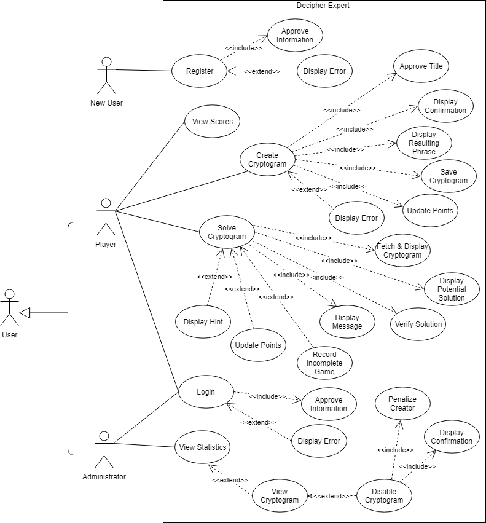

# Use Case Model

**Author**: Shuyan Huang

## 1 Use Case Diagram

    

## 2 Use Case Descriptions

**User Registeration**

- Requirements: 
    * Must allow NEW player to register an account for the app
- Pre-conditions:   
    * User must be a NEW user.
    * User must launch the application.
- Post-conditions:  
    * User creates account successfully.
    * User returns to home page.
- Scenarios:    
    * New user launches the app and clicks "REGISTER".
    * New user is prompted to input username and email. 
    * New user clicks "SUBMIT".
    * If information is approved: 
        * A successful message is displayed.
        * An account is cteated.
        * User is directd to the home page for login.
    * If information is not approved (e.g. username is not unique):
        * An error message is displayed indicating correction hints. 
        * User can choose to correct information until it is approved. 
        * Or, user can choose to click "CANCEL" and return to the home page.

**User Login**

- Requirements: 
    * Must allow existing players or the administrator to login the app
- Pre-conditions:    
    * User must be an exsiting player or the administrator.
    * User must launch the app.
- Post-conditions:   
    * User successfully login the app.
    * User is directed to main menu.
- Scenarios:   
    * User launches the app and clicks "LOGIN".
    * User is prompted to input username and email.
    * If information is approved, user login successfully and is directed to main menu. 
    * If information is not approved (username does not match email), an error is displayed and user can choose to correct information until it is approved.
    * Or, user can choose to click 'CANCEL' to return to home page.

**Create Cryptogram**

- Requirements: 
    * Must allow user to enter cryptogram title, solution phrase, unique encoded letters, hint phrase
    * Must display confirmation that the assigned name to the cryptogramis unique
    * Must display an error message if the title is not unique
    * Must allow user to view resulting phrase
    * Must allow user to edit entered information
    * Must allow user to save the cryptogram
    * Must increase user's score by 5 points opon success
- Pre-conditions:  
    * User must be an existing player.
    * User must launch the app.
    * User must login the app.
- Post-conditions:    
    * A cryptogram is successfully created.
    * User is directed to main menu.
    * User's score is updated upon success.
- Scenarios: 
    * User clicks "CREATE CRYPTOGRAM".
    * User is prompted to enter a cryptogram title, a solution phrase and a hint phrase.
    * User click 'PARSE TO UNIQUE LETTERS' button to parse the phrase into unique letters.
    * User enters unique encoded letters and click 'VIEW RESULTING PHRASE'.
    * User is shown the resulting phrase.
    * User can choose to edit until being satisfied. 
    * User clicks "CREATE".
    * If the title is approved (unique), a confirmation is displayed, cryptogram is saved and 5 points are added to the user's score. 
    * If the title is not approved, an error is displayed and User can choose to correct title until it is approved or click 'CANCEL' to go back to main menu. 

**Solve Cryptogram**

- Requirements: 
    * Must allow player to bet a number of their points with
a minimum of 1 and a maximum of 10, or all of their points, whichever is less
    * Must provide player with a random crytogram which the user has not attempted and did not create
    * Must display the cryptogram title and encrypted text along with an number of attempts remaining
    * Must allow player to match possible replacement and ecrypted letters together
    * Must allow player to view potential solution
    * Must allow player to submit answer
    * Must display a result indicating if answer is right
    * Must decrement the number of attempts if answer is wrong
    * Must display hint when there are two attempts remaining
    * Must allow player to return to main menu anytime and mark where user left
    * Must display a 'lost' message when the number of solution attempts reaches zero, remove bet points from total and return to main menu
- Pre-conditions: 
    * User must be an existing player.
    * User must launch the app.
    * User must login the app.
- Post-conditions:
    * Player's total points may get increased if the attempt is successful and player returns to main menu.
    * Player's total points may get decreased if the attempt is the last one and is failed and player returns to main menu.
    * Player may choose to return to main menu and the incomplete game is recorded so player can return later.
- Scenarios: 
    * Player clicks "SOLVE CRYPTOGRAM".
    * Player is prompted to bet a number of points and clicks "SUBMIT".
    * If bet points is not approved (see range in the requirement above), an error is displayed and user can choose to correct bet points or click 'CANCEL' to go back to main menu.
    * If bet points is approved, a random cryptogram is displayed if player does not have incomplete game.
    * Or, player is directed to the incomplete game if player has one.
    * The system displays the cryptogram title and encrypted text along with an number of attempts remaining in the game. If the remaining number of attempts is smaller or equals to two, hint is invisible.
    * Player clicks 'PARSE TO UNIQUE LETTERS' to see how many unique letters that need to be replaced.
    * Player enters possible replacements and clicks "VIEW POTENTIAL SOLUTION" to see the the resulting solution.
    * Player keeps on modifing until being satisfied.
    * Player clicks "SUBMIT". Then:
        * If the solution is successful and the number of remaining attempts is larger than two, a success message is displayed along with the player's score increased by the bet points. User clicks 'OK' to return to main menu.
        * If the solution is successful and the number of remaining attempts is smaller or equals to two, a success message and user's current score are displayed. User clicks "OK" to return to main menu.
        * If the solution is unsuccessful, a unsuccess message is displayed and the remaining number of attempts is decremented. User can modify encoded letters and submit again.
        * If the number of attempts reaches zero, a loss message is displayed and the number of bet points is removed from player's total points. User clicks "OK" and returns to main menu.
    * Upon clicking "Return" at any point, user return to main menu and system records the incomplete game. 

**View Scores**

- Requirements: 
    * Must allow player to view the list of player scores
    * Must display the list of player scores in descending order of total points
- Pre-conditions: 
    * User must be an existing player.
    * User must launch the app.
    * User must login the app.
- Post-conditions:
    * The list of player scores is displayed with a list of players in descending order of total points.
- Scenarios: 
    * Player clicks "VIEW SCORES".
    * The list of player scores is displayed with each entry having username, the number of cryptograms attempted and total number of points, in descending order of total points.

**View Statistics**

- Requirements: 
    * Must allow the administrator to view the list of cryptogram statistics
    * Must display the list of cryptograms from newest to oldest
- Pre-conditions: 
    * User must be the administrator.
    * User must launch the app.
    * User must login the app.
- Post-conditions:
    * The list of cryptogram statistics is displayed from newest to oldest.
- Scenarios:
    * Administrator clicks "VIEW STATISTICS".
    * The list of cryptogram statistics is displayed with each entry having the time of creation, the title, the creator's username, the number of games using that cryptogram completed by all players and the percentage of wins out of total completed games, from newest to oldest.

**Disable Cryptogram**

- Requirements: 
    * Must allow the administrator to select each cryptogram 
    * Must allow the administrator to view encrypted phrase, solution phrase and hint of each cryptogram
    * Must allow the administrator to disable any cryptogram
    * Must allow the administrator to penalize the creator of the disabled cryptogram
    * The penal points should be 0-10 points or the player’s
total number of points, if that is less
- Pre-conditions: 
    * User must be the administrator.
    * User must launch the app.
    * User must login the app.
    * User must have clicked "View Statistics".
- Post-conditions:
    * The information of the selected cryptogram is displayed, including its enctypted phrase, solution phrase and hint.
    * Cryptograms may be disabled.
    * Creators of disabled cryptograms are penalized.
- Scenarios:
    * On statistics page, administrator clicks each cryptogram to view details.
    * The information of the selected cryptogram is displayed, including whether the cryptogram is disabled, the encrypted phrase, solution phrase, and hint.
    * Administrator can click 'DISABLE' button and is prompted to enter penal points.
        * If the penal point is approved (see range in the requirement above), a confirmation is displayed. The cryptogram is disabled. The creator's total points is reduced.
        * If the penal point is not approved, administrator can choose to modify it or click 'CANCEL' to go back to view cryptogram page. 
    * On view cryptogram page, admistrator can click 'RETURN' button to go back to statistics page.