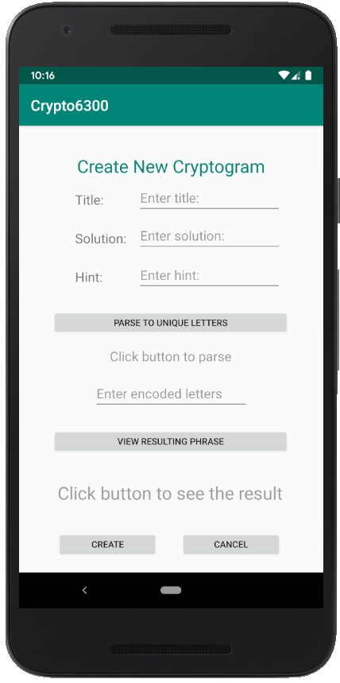

# User Manual
**Author**: Shuyan Huang

## Home Page
When you open the application, you will be shown the following Home Page. If you have an account, you can simply enter your username and click the `LOGIN` button which will show the Login Page. If you are a new user, you must register for an account by clicking the `REGISTER` button which will show the Registration Page.

    

## Login Page

You can login with your username and email and click the `SUBMIT` button or click `CANCEL` button to return to the Home Page. Or you can login as the administrator by inputting "admin" to the Username input box and "admin@sdp.com" to the email input box.

    

## Registration Page

To finish the registration process, you must insert the following information: username, and email. After click the `SUBMIT` button, you are successfully registered. Clicking `CANCEL` button will bring you to the Home Page. Please note that it is not allowed to register with an existing username although with different email.

    

## Main Menu for Player Page

After you login as a player, you will be shown the Main Menu for Player Page. In this page, you can: (1) create a cryptogram, (2) solve a random cryptogram, (3) view the list of player scores, and (4) log out.

    

## Main Menu for Administrator Page

After you login as the administrator, you will be shown the Main Menu for Administrator Page. In this page, you can:  (1) view the list of cryptogram statistics and disable a cryptogram, (2) log out.

    

## Create Cryptogram Page

To add a new cryptogram, you will: (1) enter a unique cryptogram title, (2) enter a solution (unencoded) phrase, (3) enter a hint phrase (to help players solve the puzzle), (4) Click `PARSE TO UNIQUE LETTERS` button to view unique letters in the solution letters, (5) select unique encoded letters to replace each unique letter in the solution phrase, enter them by comma (6) view the resulting encoded phrase with capitalization and any non-alphabetic characters preserved by clicking the `VIEW RESULTING PHRASE` button. You can click the `CREATE` button to submit your Cryptogram or press the `CANCEL` button to quit.

    

## Solve Cryptogram Page
Before solve a cryptogram, bet points need to be input firstly. In the pop up window, enter your bet points. Click `SUBMIT` button to solve a cryptogram or click `CANCEL` button. In the Solve Cryptogram Page, (1) click `PARSE TO UNIQUE LETTERS` button to view unique letters in the encoded letters, (2) enter uncoded letters to replace the encoded letters, (3) click `VIEW RESULTING PHRASE` button to view potential solutions, (4) click `SUBMIT` button to submit your solutions or click     `CANCEL` button. In the top of the page, the title of the cryptogram and the remaining attempts are shown. At the bottom of the page, the player's score and the hint field is shown.

    
    

## View Player Scores Page
In the View Player Scores Page, all player scores will be displayed as a list of players in descending order of total points. The entry for each player will show their username, the number of cryptograms attempted, and their total number of points. Click `RETURN` button to quit.

    

## View Statistics Page
In the View Statistics Page, a list of cryptograms from newest to oldest are displayed. The entry for each cryptogram will show its title, its creator’s username, the number of games using that cryptogram completed by all players, and the percentage of wins out of total completed games. The administrator may click each cryptogram to either: view its encrypted phrase, solution phrase, and hint. Or click `DISABLE` button to disable a cryptogram. To disable a cryptogram, the administrator needs to enter penalized points to discourage the creator in a pop up window. Then the cryptogram is disable.

    
    

